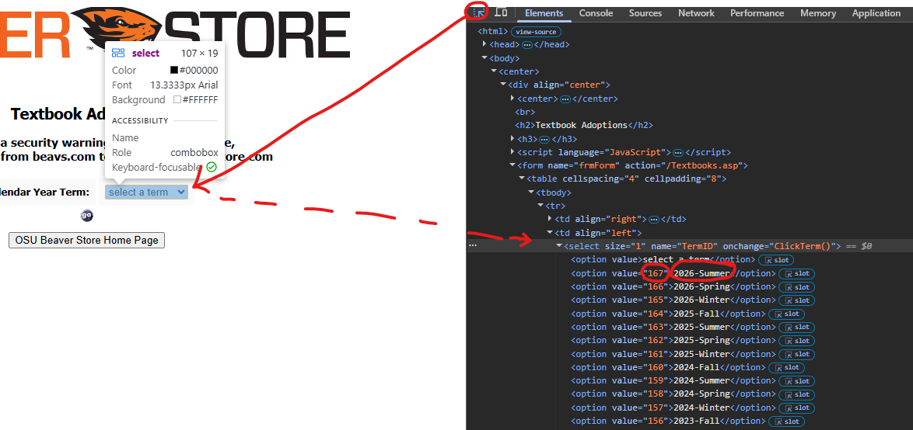

# Master Textbook PrePurchasing Excel Script
Hello! This script aims to consolidate many projects that have been spun up to reduce amounts of manual data entry hours in regards to textbook data management as well as prepurchasing workflows. The hope is that this will remain functional, updateable / modifiable, as well as compatible with prior implementations of workflows.

I will do my best to document how this script is formatted and constructed so that any updates in the future will be less painful than they need to be, with highlighting the things that would be most likely to cause issues. As a forewarning, this is a very large script, split across several files to help with data flow and readability.
## How to Use (Quick Guide)
This will be a quick and fast way of using this script, this will skip out on details that are less important or required for using the script. It will purely be aimed to make the script **useable** as it is without changing anything in the settings, as well as breaking it into specific steps.
### Setup
#### Python
First, we need to install Python. This can be easily done from the Microsoft Store. Search Python and install one of the recent `Python 3` versions.


After this, run `install.bat` and let it run to completion.
#### Files
We need to ensure that we grab a couple files before starting.

Core enrollment data for the term needs to be exported to CSV, renamed to `enrollment.csv` and placed in `/helpers/csv/`. If one already exists there, replace it.

If you already have the Excel sheet for the term, download a copy of it, place it in the main folder of the script. Rename the file to `output.xlsx`. In addition to this, open `config.ini`, change `Sheetname` under `[Email]` to the name of the sheet that you're wanting to modify / update / use data in.

For example here, you would write `Spring26`. Save the configuration file after modifying.


If this is the first time running this script in a while, ensure to update the bookstore information by selecting the `2` option on each case.


If the `Most Recent` term is not the information you are looking for, feel free to navigate to the `Configuration` section of this README, specifically under the `Textbook` section of how to change `CustomNum` and `CustomName`. This will allow you to choose different terms to pull data from.

After this, the script should be good to use for each of the use cases.

### Making Initial Excel Sheet
1. Sign into Outlook
2. Open an email composition window by clicking `New mail`
3. Leave the Outlook window alone; sign into the new Alma window
4. Go to Analytics -> Access Analytics, leave it alone after opening the new window
5. It will automate through any information it needs, the only input from here is ensuring Emails are accurate
### Making Emails & Updating Sheet

## Further Details
### Installing Python Libraries
Feel free to make use of the `install.bat` file if you are on a Windows machine and have python/pip installed. This will automatically run the following command, if this file does not work or you are on a different kind of machine, this command should function if typing into a console window.

```pip install -r helpers/requirements.txt```

If you want to install the individual libraries instead, feel free to go to `requirements.txt` inside the `helpers` folder to see which individual libraries are being used and are necessary. Once these libraries are setup, the script should now be usable.

If you're having problems such as "pip is not recognized as a valid command" or things like that, make sure python is properly installed. On Windows, this *does* require going to the Microsoft Store and installing it from there.
### Prior Setup
include something about CORE enrollment & such here, file naming
### Script Usage
Upon running `main.py` via the `run.bat` file or the `python main.py` command, it will begin running and present the user with a main menu.

There are currently four options:
1. `Create new Excel Sheet`
2. `Update .csv files`
3. `Create email Excel sheet`
4. `Update Excel sheet`

We'll go through these one by one.
#### 1. Create new Excel Sheet
This will run all the selected options from the `config.ini` file, which will by default be set to enable (almost) everything to ensure all the information is filled in upon creating a new sheet. The only thing that will be set to not run by default is the Bookstore information. Instead, the Bookstore information should be pre-pulled beforehand (using the `Update .csv files` action), as it is only really necessary to scrape once per term, it updates much less frequently. If you want to open an instance of the Bookstore scraper every time, change `Import` to `False` under the `[Bookstore]` configuration section.

**First,** this will open up an Outlook log-in (presuming `Enabled`=`True` under the `[Grabber]` section of `config.ini`). Log into any ONID account that has access to the email directory. It will keep stating `Compose box not found.` until a new email/compose window has been opened. 


Just click on this button once you log in and do not touch anything in this window yet.

**Second,** another window will open with an Alma log-in screen (presuming `Enabled`=`True` under the `[Alma]` section of `config.ini`). Log into any account with access to the Access Analytics section.


Once opening the new tab by clicking this button, also just leave this window alone.

From here, the only window that should ask that you interact with it is the Outlook window. Every once in a while the console will say `Awaiting manual input. (Hit enter when name is ready)`. This is indicating that it could not automatically source an email for a name, sometimes because it cannot find a single email or there are multiple emails and it wants to make sure it is correct. If it is already on the correct person/email, just hit enter. Otherwise, it should also be displaying the professor name above the previous prompt, type this in or try to find the associated email, once it is at the top of the suggestion box (as per the next image), feel free to hit enter and it will pull whichever email is at the top of the suggestion list. 


It also may say `Double check the name / email, if incorred, type "n":`, if it is fine, hit enter, otherwise typing `n` in will kick this back to the manual input, and you can type in the name to correct it.

**If it is blank or not a person** ensure that the suggestion box is empty or gone, and then hit enter, this will tell the program to fill in `NO EMAIL`.

After all this, it will run to completion and compile a new Excel sheet at the location of the `[Main]` config (by default `output.xlsx` within the main folder).
#### 2. Update .csv files
Within this mode, it will provide three more options
1. `Email Data`
2. `Bookstore Data`
3. `Analytics Data`

Updating the **email data** will have the user do the same things listed above, with logging into an Outlook page, opening a new email box, and then manually interacting to validate email inputs.

Updating the **Bookstore data** will open a page to the Beaver Bookstore. Pass the CAPTCHA, then it will provide the user with yet another submenu. This menu will have some options, but I recommend using `2. Most Recent` as it will pull the most recent term that is listed on the site automatically. If you need a different term, select the `Custom` option with `3`, ensuring beforehand you set the right values in `config.ini`. To see how to do that, go to the next major section `Configuration`, looking for the `Textbook` section. **It is important that this update function is done before creating a new sheet for a term.**

Updating the **analytics data** will help to cutdown time spent creating a new sheet by storing all of the Alma analytics data beforehand. This is by far the part that takes the **longest**, so it is good to do this earlier rather than later. This also is reading the ISBN values directly from whatever sheet is located at the output location, so if you need to change the name or direct it to specific ISBN values, please ensure that it is the file listed under `[Main]` and `OutputFile`, as well as the correct `SheetName` value in `[Email]`.
#### 3. Create email Excel sheet
#### 4. Update Excel sheet
## Common Errors / Troubleshooting
## Configuration (config.ini)
While I would not recommend those who are not confident to modify this file, I promise it is not as scary as it looks. If you are ever unsure, make a copy of it to preserve functioning values, then modify the original, and run the script.

It may ultimately be easier to change file names to match the corresponding input file name (i.e. the CORE enrollment CSV export file -> enrollment.csv in the helpers/csv/ folder), but it can also be manually changed here.
### Main
This is the main set of values for the script.
- `Debug`
  - set to either `True` or `False`
  - turns on/off printing details to the console from the main script
- `RemoveDuplicates`
  - set to either `True` or `False`
  - attempts to remove duplicate listings of books
- `RemoveSeeCanvas`
  - set to either `True` or `False`
  - removes the listings that say "SEE CANVAS" from the data
- `OutputDir`
  - set to subfile name, `.` for main file
  - dictates which subfile a new Excel sheet will be created at
- `OutputFile`
  - set to exact file name, ending in `.xlsx`
  - this is the name of the Excel sheet that is created, as well as the file that is updated with information
### Textbook
These values mainly affect how data is stored and used for processing bookstore textbook information.
- `Output`
  - set to either `True` or `False`
  - turns on/off printing details to the console from the bookstore script
- `NoCostSkip`
  - set to either `True` or `False`
  - turns on/off skipping "NO COST"
- `Save`
  - set to either `True` or `False`
  - turns on/off saving data processed by the script
- `Import`
  - set to either `True` or `False`
  - turns on/off importing in existing bookstore information
- `SaveDir`
  - set to subfile name, `.` for main file
  - dictates which subfile the csv save file will be exported to
- `SaveFile`
  - set to exact file name, ending in `.csv`
  - this is the name of the csv file that gets saved, as well as which file to import
- `CustomNum`
  - set to an integer value
  - this number comes from the HTML of the Beaver Bookstore page
- `CustomName`
  - set to a string value
  - this string comes from the HTML of the Beaver Bookstore page
  - to reach either of these, right click the page, click on "Inspect", then look for the appropriate values at the location shown in the image
  
### Enroll
These values mainly affect how CORE enrollment data is used.
- `Enabled`
  - set to either `True` or `False`
  - turns on/off importing the enrollment data into the script
- `InputDir`
  - set to subfile name, `.` for main file
- `InputFile`
  - set to exact file name, ending in `.csv`
### Email
These values mainly affect how the sheets are processed to create the email Excel sheet that goes into PowerAutomate.
- `Sheetname`
  - set to a string value
  - this should be set to the name of the Excel sheet that the data is being pulled from
  - 
- `InputDir`
  - set to subfile name, `.` for main file
- `InputFile`
  - set to exact file name, ending in `.xlsx`
- `SaveDir`
  - set to subfile name, `.` for main file
- `SaveFile`
  - set to exact file name, ending in `.xlsx`
### Grabber
These values mainly affect how the information from Outlook is processed and used, as well as stored after the fact.
- `Enabled`
  - set to either `True` or `False`
  - turns on/off opening up an Outlook window to import new emails
- `EmailLink`
  - set to a string value
  - direct link to the Outlook inbox
- `Save`
  - set to either `True` or `False`
  - turns on/off saving data processed by the script
- `Import`
  - set to either `True` or `False`
  - turns on/off importing in existing professor email information
- `SaveDir`
  - set to subfile name, `.` for main file
- `SaveFile`
  - set to exact file name, ending in `.csv`
### Alma
These values mainly affect how the analytics section of the script functions and stores information.
- `Enabled`
  - set to either `True` or `False`
- `Save`
  - set to either `True` or `False`
  - turns on/off saving data processed by the script
- `Import`
  - set to either `True` or `False`
  - turns on/off importing in existing alma analytics information
- `SaveDir`
  - set to subfile name, `.` for main file
- `SaveFile`
  - set to exact file name, ending in `.csv`
- `AnalyticsLink`
  - direct link to the Alma log-in page
- `QueryPage`
  - query part of the URL for Alma Analytics
## Documentation
### The Easy Parts to Modify
#### Headers
The headers row! This script wholly relies on one spot to update and read this data. In `utilities.py` under the `get_sheet_headers()` function, there are two variables. One is named `head_names` (dictionary) the other named `main_headers` (list). The dictionary is to read and output names across the board, you can change any of the values on the right to their corresponding key on the left to make the script read and output different titles and names for the columns. As far as the list goes, this is what dictates outputting the order of the spreadsheet. Move the dictionary keys around to modify that.

As far as I am aware, the list order does NOT impact reading, unlike the dictionary. You do not need to be concerned with updating the order of columns in the case it gets changed and you want to use this script to update.
#### Title & Author Cleaners
In order to cut down on duplicate listings for similar books, there is a "cleaning" list of values, found under `utilities.py` in the `get_string_cleaners()` function. The `book_clean` list is used to remove these tags from book titles (in Title Case), while the `author_clean` list removes these tags from author names (also in Title Case).
#### Configuration
This has its own section up above, but I hugely recommend looking at this! There are some parts I will put down as recommending to not modify, but other parts that may cause some issues / will save you some time!
### Less Easy, but of Interest
#### Course / Section / etc. Headers
This is less straightforward to change due to how it is structured. Under `utilities.py`, the `get_format_headers()` function provides the structure for creating the headers for the courses and sections area of the sheet. If you wanted to change how these names appear, it is constructed by chaining them together, with a special character that gets replaced for the numbers later. It is **important** that they remain chained together, as it will likely break reading the dataframe / excel sheet back in due to the ambiguity of which section is tied to which course, etc. However, if you want to change the way individual pieces are titled, feel free to change `course_header`, `section_header`, and `instructor_header` as long as they include one another like it currently does, but don't modify the list order.
### Everything Else
This section will go over the rest of the code in more precise detail about what files contain which functions, as well as what they do. Some functions may be glossed over, but this is likely due to their mostly simple nature, as with some of the functions in `utilities.py`, but everything within the code itself will be properly documented with a doc string, as well as comments (I hope).